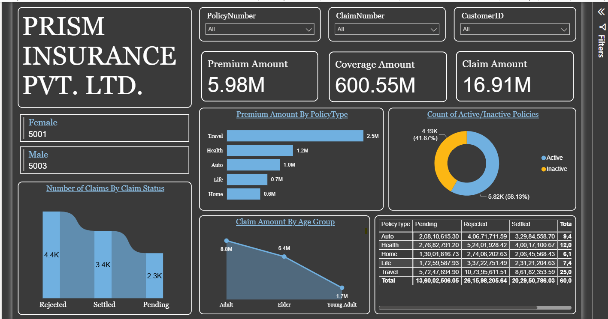
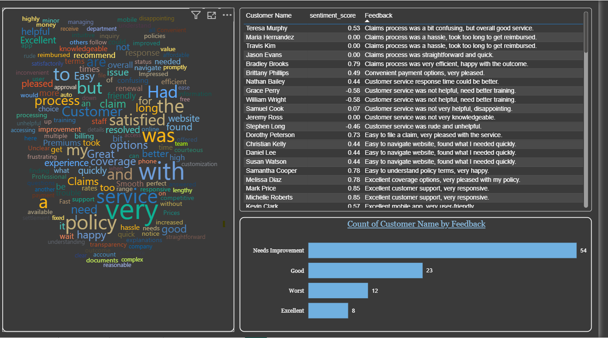
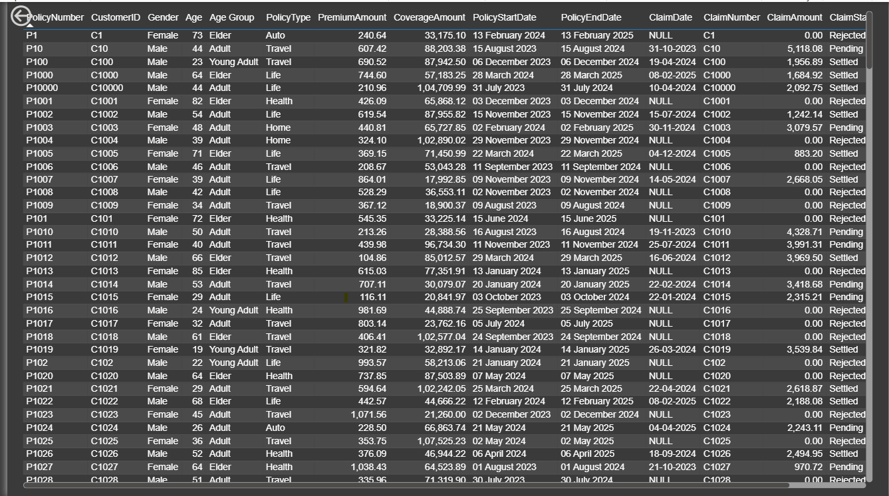

# 📊 Prism Insurance Analytics Dashboard

## Project Overview

This project is an Insurance Analytics Dashboard built in Power BI to analyze policy performance, claim activity, customer demographics, and customer feedback.

The dataset was first uploaded into Microsoft SQL Server and then connected directly to Power BI for reporting and visualization. SQL Server was used as the data storage layer, while all calculations, KPIs, and reporting were developed in Power BI.

The dashboard provides a centralized view of key insurance metrics and helps stakeholders monitor policy performance, claim trends, customer behavior, and overall business performance.

---

## Tech Stack

The dashboard was built using the following tools and technologies:

- **Microsoft SQL Server** – Used to store the source dataset.
- **Power BI Desktop** – Used for dashboard development and visualization.
- **Power Query** – Used for data loading and preparation.
- **DAX (Data Analysis Expressions)** – Used to create measures and KPIs.
- **Data Modeling** – Used to establish relationships and support interactive reporting.
- **PBIX File** – Used for dashboard development.

---

## Data Source

**Source:** Insurance Dataset

### Data Flow

```text
CSV File
    ↓
Microsoft SQL Server
    ↓
Power BI
    ↓
Interactive Dashboard
```

The CSV file was loaded into SQL Server and connected directly to Power BI.

No ETL process or transformation was performed in SQL Server. SQL Server was used only as the source database, while analysis and reporting were performed in Power BI.

---

## Business Problem

Insurance companies generate large amounts of data related to policies, claims, coverage, premiums, and customer interactions.

Without a centralized reporting solution, it becomes difficult to:

- Monitor policy performance.
- Track claim activity.
- Understand customer demographics.
- Measure customer satisfaction.
- Identify trends and business opportunities.
- Support data-driven decision making.

---

## Goal of the Dashboard

The goal of this dashboard is to:

- Monitor key insurance KPIs.
- Analyze policy and claim performance.
- Understand customer demographics.
- Track claim settlement trends.
- Measure customer satisfaction using sentiment analysis.
- Provide business insights through interactive visualizations.

---

# Dashboard Pages

## 1. Insurance Overview Dashboard

This page provides a high-level summary of insurance performance.

### Key KPIs

- Premium Amount
- Coverage Amount
- Claim Amount

### Key Visuals

#### Premium Amount by Policy Type

Compares premium revenue generated across different policy categories:

- Travel
- Health
- Auto
- Life
- Home

#### Active vs Inactive Policies

Displays the distribution of active and inactive policies.

#### Number of Claims by Claim Status

Tracks claim volume by status:

- Settled
- Pending
- Rejected

#### Claim Amount by Age Group

Analyzes claim amounts across:

- Young Adult
- Adult
- Elder

#### Policy Type vs Claim Status Matrix

Provides a detailed breakdown of claim amounts by policy type and claim status.

---

## 2. Customer Feedback & Sentiment Analysis

This page focuses on customer experience and feedback analysis.

### Key Visuals

#### Word Cloud

Highlights frequently used words in customer feedback and reviews.

Common themes include:

- Service
- Policy
- Claims
- Support
- Coverage
- Process

#### Customer Feedback Table

Displays:

- Customer Name
- Sentiment Score
- Customer Feedback

#### Feedback Category Analysis

Customer feedback is grouped into:

- Excellent
- Good
- Needs Improvement
- Worst

This helps identify areas that require attention and improvement.

---

## 3. Detailed Data View

This page provides a detailed view of the underlying insurance records.

### Included Fields

- Policy Number
- Customer ID
- Gender
- Age
- Age Group
- Policy Type
- Premium Amount
- Coverage Amount
- Policy Start Date
- Policy End Date
- Claim Date
- Claim Number
- Claim Amount
- Claim Status

This page allows users to inspect individual records and perform detailed analysis.

---

## Business Insights

The dashboard helps answer questions such as:

- Which policy types generate the highest premium revenue?
- What is the distribution of active and inactive policies?
- Which age groups generate the highest claim amounts?
- How are claims distributed across different statuses?
- What are customers saying about the claims process and service quality?
- Which areas of customer experience require improvement?

Some key findings include:

- Travel policies contribute the highest premium revenue.
- Adult customers generate the highest claim amounts.
- Customer feedback highlights both strengths and improvement opportunities in service quality.
- Claim status analysis helps monitor operational performance.

---

## Skills Demonstrated

This project demonstrates:

- SQL Server Data Connectivity
- Power BI Data Modeling
- DAX Calculations
- KPI Development
- Insurance Analytics
- Claims Analysis
- Customer Analytics
- Sentiment Analysis
- Dashboard Design
- Business Insight Generation

---

## Dashboard Screenshots

### Insurance Overview Dashboard





### Customer Feedback & Sentiment Analysis





### Detailed Data View




---

## Conclusion

This project demonstrates how Microsoft SQL Server and Power BI can be used together to create an interactive insurance analytics solution.

By combining policy, claim, customer, and feedback data into a single dashboard, the report provides meaningful insights that help monitor business performance, improve customer experience, and support better decision-making.
